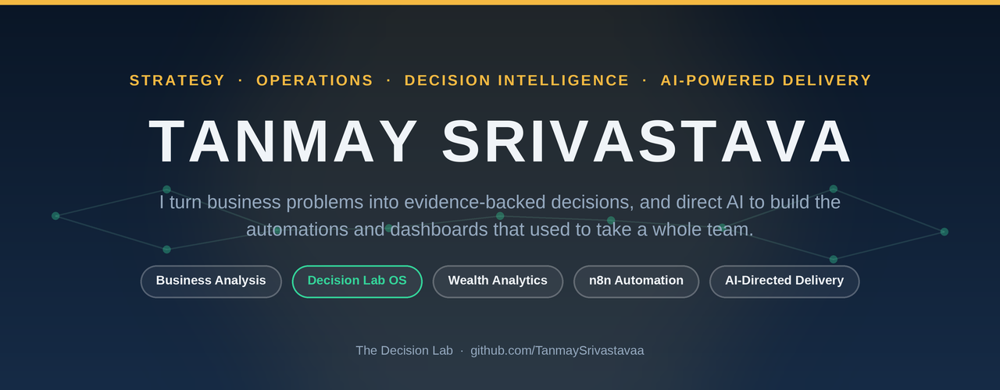

<p align="center">
  
</p>

<p align="center">
  <a href="https://www.linkedin.com/in/tanmaysrivastavaa"></a>
  <a href="https://orcid.org/0009-0004-5188-0332"></a>
  <a href="mailto:tanmysrivastava@gmail.com"></a>
  
</p>

---

### About Me

I work where business strategy meets AI-powered delivery. My background is business analysis, so most days I'm not writing code line by line — I'm directing AI tools like Claude to build the automations, dashboards, and analysis that used to take a full team, then testing and refining the output myself.

Right now I'm building **Decision Lab OS**, an operating system for running consulting-style engagements end to end, and maintaining a **personal finance dashboard** that's been in real, daily use for months. I'm also learning n8n to move from one-off scripts into proper automation pipelines.

```
Role         Business Analyst · AI-Orchestrated Delivery
Focus        Strategy, operations, decision intelligence
How I build  Direct AI tools to build, then test and refine the output
Based in     India
```

---

### What I'm Building

<table>
<tr>
<td width="50%" valign="top">

**[Decision Lab OS](https://github.com/TanmaySrivastavaa/decision-lab-os)**

An operating system that turns a real business problem into a structured, evidence-backed consulting engagement — problem framing, research, evidence governance, analysis, strategy, dashboards, an executive memo, QA, and explicit human approval before anything ships.

Organized as 6 pods and 24 working agents plus 3 control gates. The standard is flagship-only: no fictional data, no fake metrics, no release without human sign-off.

`Python` `Automation` `Decision Intelligence`

</td>
<td width="50%" valign="top">

**[Wealth Analytics Dashboard](https://github.com/TanmaySrivastavaa/wealth-analytics-dashboard)**

A personal finance dashboard that parses bank statements, mutual fund CAS reports, ULIP statements, demat holdings, insurance policies, and income tax reports into one live net-worth view — with live market pricing and a built-in Privacy Mode that blurs every figure on screen.

A real, actively-used system, not a demo. 51 tests, CI on every push, Python 3.10–3.12.

`Python` `pandas` `pytest` `GitHub Actions`

</td>
</tr>
</table>

---

### How I Work

<p align="left">
  
  
  
  
  
  
  
  
</p>

I treat AI as a delivery partner, not a shortcut: I brief it clearly, review everything it produces, and I'm accountable for what ships. That means my strength isn't typing syntax from memory — it's framing the problem correctly, judging whether the output is actually right, and knowing when to push back and ask for another pass.

---

### Currently

```
Building    Decision Lab OS — moving from manually orchestrated agents
            toward a command-driven, evidence-governed system
Refining    Wealth Analytics Dashboard — a live project, updated with
            every new bank/fund/insurance statement
Learning    n8n, to replace ad-hoc scripts with real automation pipelines
Open to     Roles in business analysis, AI-powered operations,
            and decision intelligence
```

---

### GitHub Stats

<p align="center">
  
  
</p>

---

<p align="center"><sub>Thanks for stopping by — feel free to open an issue on any repo if you want to talk shop.</sub></p>
